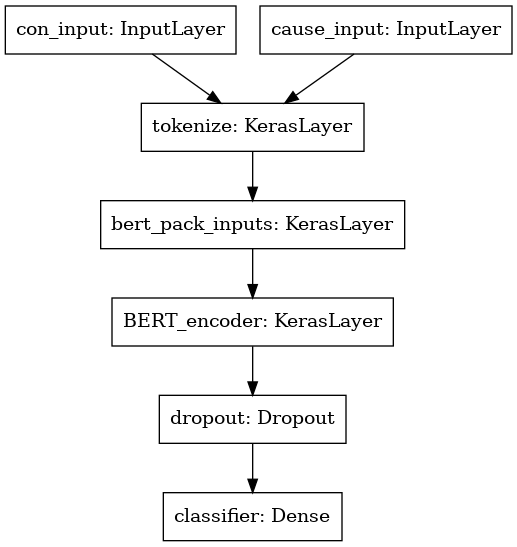

# Sequence Matching Model Documentation
## 概述
### 输入
* con_input
争议焦点，类型`tf.string`，utf-8编码
* cause_input
依据，类型`tf.string`，utf-8编码
### 输出
* logregress_output
是否相关，范围0-1，0表示不相关，1表示相关
## 模型

> 具体参数见[ipynb](../training/seq_match.ipynb)
## 训练数据
| controversy | cause | matched(0 or 1) |
| --- | --- | --- |
| aaa | bbb | 1 |
| ccc | ddd | 0 |
## 损失函数 指标 优化器 
* 损失函数 & 指标

因为是逻辑回归，所以选择Binary Cross Entropy，指标选择了BinaryAccuracy，考虑到训练样本中正向样本和负向样本比例不均衡，所以加了准确率和召回率来弥补Accurcy可能带来的偏差
```python
loss = tf.keras.losses.BinaryCrossentropy()
metrics = [tf.metrics.BinaryAccuracy(),
           tf.keras.metrics.Precision(name='precision'),
           tf.keras.metrics.Recall(name='recall')]
```
* 优化器

优化器Adam的改进版本——AdamW，纯粹个人喜好
* 超参数

batch size：训练过程中 8 和 16 都用了，都可以让模型收敛，缩小batch size 最好同时减少学习率

学习率：1e-3 - 1e-5 随缘设置

学习率预热：开启✅

## 实现
具体见[ipynb](../training/seq_match.ipynb)

## Serving
使用TF Serving + Docker部署推理服务，Restful API 进行调用。设置了动态Batchsize，最大Batchsize等于核心数
